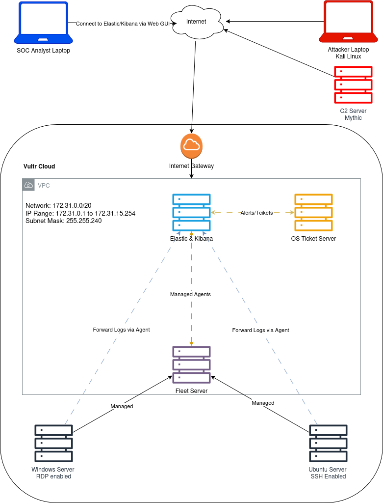

# Day 01: Introduction & Network Diagram Creation

## Introduction

- The 30-day challenge aims to help aspiring SOC analysts gain practical experience.
- Created by Steven, a cybersecurity professional with 8 years of experience in security operations.
- Focuses on hands-on skills to build confidence.

### Network Diagram

1. Accessing Draw.io
    
    - Open [draw.io](https://www.draw.io).
    - Explore basic tools: Shapes (General Tab), Grid, Background, Styles.

2. Creating the Network Diagram
    
    - Cloud Provider: Vultr (Hosting all virtual machines).
    - Servers & Computers in the Setup:
        - Elastic & Kibana Server
        - Windows Server (RDP enabled)
        - Ubuntu Server (SSH enabled)
        - Fleet Server
        - OS Ticket Server
        - C2 (Command & Control) Server (Marked in Red)
        - SOC Analyst Laptop 
        - Attacker Laptop (Marked in Red)

[Day 02 ELK Stack – Elasticsearch Logstash and Kibana](Day%2002%20ELK%20Stack%20%E2%80%93%20Elasticsearch%20Logstash%20and%20Kibana.md)
