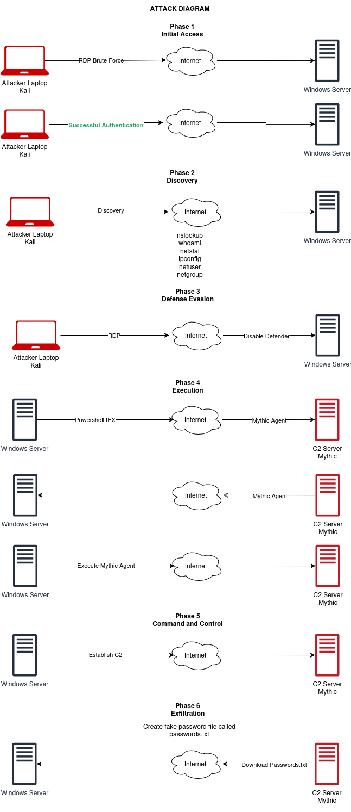

# Day 19: Creating an Attack Diagram

## 1. Introduction

**Goal**: Create an attack diagram to plan the attack on the target machine and establish a C2 connection.

## 2. Tools

**[Draw.io](https://www.draw.io/)**: Used to create the attack diagram.

## 3. Attack Diagram Components

**Mythic C2 Server**:

- **Color**: Red
- **Role**: Command and control server

**Windows Server**:

- **Role**: Target machine

**SSH Server**:

- **Role**: Potential future target

**Attacker Laptop**:

- **OS**: Kali Linux
- **Color**: Red

**Internet**:

- **Role**: Connection medium

## 4. Attack Phases

### Phase 1: Initial Access

- **Method**: RDP Brute Force
- **Goal**: Successful authentication

### Phase 2: Discovery

- **Commands**: `whoami`, `ipconfig`, `net user`, `net group`
- **Goal**: Check permissions and gather information

### Phase 3: Execution

- **Method**: Download Mythic agent via PowerShell (`IEX` - Invoke Expression)
- **Goal**: Execute Mythic agent on Windows Server

### Phase 4: Execution

- **Method**: Download Mythic agent via PowerShell (`IEX` - Invoke Expression).
- **Goal**: Execute Mythic agent on Windows Server.

### Phase 5: Command and Control (C2)

- **Action**: Establish C2 session with Mythic agent.
- **Goal**: Gain control over the Windows Server.

### Phase 6: Ex filtration

- **Action**: Create a fake password file (`passwords.txt`) on Windows Server.
- **Goal**: Use C2 session to download `passwords.txt` and analyze telemetry.

## Diagram

